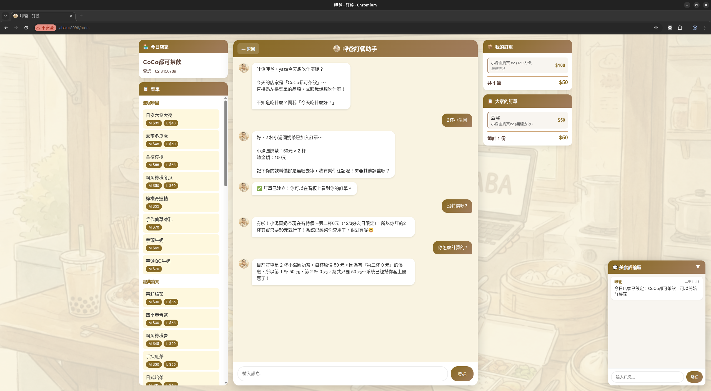

# jaba (呷爸)

AI 午餐訂便當系統 - 用自然語言輕鬆訂餐

呷爸是一個專為團隊設計的午餐訂餐系統，透過 AI 對話介面讓訂餐變得簡單直覺。使用者只需用自然語言告訴呷爸想吃什麼，系統就會自動處理訂單。

## 功能特色

### 使用者功能
- **AI 對話訂餐** - 用自然語言與 AI 互動，說「我要點雞腿便當」就能完成訂餐
- **快速點餐** - 點擊菜單項目直接加入訂單
- **多店家選擇** - 當天有多家店時，可自由選擇想訂的店家
- **訂單修改** - 可新增、移除品項或取消訂單
- **特價優惠** - 自動套用促銷折扣（買一送一、第二杯折扣、限時特價）
- **卡路里估算** - AI 自動估算餐點熱量
- **個人偏好** - 記住你的稱呼和飲食偏好

### 管理員功能
- **店家管理** - 新增、編輯、啟用/停用店家
- **菜單辨識** - 上傳菜單圖片，AI 自動辨識並建立菜單
- **差異預覽** - 辨識後顯示新增/修改/可刪除項目，選擇性套用變更
- **特價辨識** - 自動識別促銷標示（買一送一、第二杯折扣、限時特價）
- **菜單編輯** - 手動調整品項名稱、價格、尺寸變體
- **今日設定** - 設定單一或多家今日營業店家
- **訂單總覽** - 即時查看所有訂單與品項統計
- **付款追蹤** - 標記付款狀態、處理退款
- **歷史清理** - 清除過期訂單資料

### 系統功能
- **即時同步** - Socket.IO 即時廣播訂單與狀態變更
- **瀏覽器通知** - 新訂單、訊息即時推播通知
- **團體聊天** - 內建即時聊天室方便同事溝通
- **Session 管理** - 每日對話紀錄自動管理

### LINE Bot 群組點餐
- **群組點餐 Session** - 群組專屬點餐流程，訂單獨立於個人訂單
- **共享對話歷史** - AI 可理解跟單（+1）等上下文
- **飲料縮寫辨識** - 支援「微微」「少少」「半半」等常見點法
- **自動過濾** - AI 自動辨識訂餐訊息，忽略閒聊

## 系統畫面

| 頁面 | 說明 |
|------|------|
| `/` | 今日訂餐看板 - 顯示店家、訂單列表、品項統計 |
| `/order` | 訂餐頁面 - AI 對話、菜單瀏覽、快速點餐 |
| `/manager` | 管理頁面 - 店家管理、訂單總覽、付款追蹤 |

### 今日看板


顯示今日店家、訂單列表與品項統計，方便團隊查看訂餐狀況。

### 訂餐頁面



左側為菜單、中間為 AI 對話區、右側為訂單摘要與聊天室。

### 管理頁面


管理員可透過對話設定店家、查看訂單、標記付款狀態。

### 菜單辨識與差異預覽


上傳菜單圖片後，AI 自動辨識並顯示差異預覽：綠色為新增、黃色為修改、紅色為可刪除。

> 完整 Demo 流程請參考 [demo/DEMO.md](demo/DEMO.md)

## 技術架構


| 組件 | 技術 |
|------|------|
| 後端框架 | FastAPI + Socket.IO (ASGI) |
| AI 整合 | Claude CLI / Gemini CLI (Provider 模組化架構) |
| 前端 | 純 HTML/CSS/JavaScript |
| 資料存儲 | JSON 檔案 |
| 套件管理 | uv |

## 快速開始

### 環境需求

- Python 3.12+
- [uv](https://docs.astral.sh/uv/) 套件管理器
- [Claude CLI](https://docs.anthropic.com/en/docs/claude-cli) 或 Gemini CLI

### 本機執行

```bash
# 安裝依賴
uv sync

# 設定 API 金鑰（Claude CLI 需要）
export ANTHROPIC_API_KEY="your-api-key"

# 啟動伺服器（預設 port 8098）
uv run uvicorn main:socket_app --reload --host 0.0.0.0 --port 8098
```

## 使用指南

### 一般使用者


1. 開啟訂餐頁 `/order`
2. 輸入你的名字開始訂餐
3. 與呷爸對話，例如：
   - 「我要點雞腿便當」
   - 「幫我加一碗湯」
   - 「不要了，取消訂單」
   - 「今天吃什麼好？」
4. 或直接點擊左側菜單快速加入

### 管理員

1. 開啟管理頁 `/manager`
2. 輸入管理員密碼登入（預設：`9898`）
3. 可執行的操作：
   - 「今天吃佳香味」- 設定今日店家
   - 「新增店家 xxx」- 建立新店家
   - 「小明已付款」- 標記付款
   - 「清除所有訂單」- 重置今日訂單
4. 上傳菜單圖片讓 AI 自動建立菜單

## 專案結構

```
jaba/
├── main.py                 # FastAPI 應用程式入口
├── app/
│   ├── ai.py               # AI 整合主入口
│   ├── data.py             # 資料存取模組
│   └── providers/          # CLI Provider 模組
│       ├── __init__.py     # BaseProvider 抽象類別與工廠
│       ├── claude.py       # Claude CLI 實作
│       └── gemini.py       # Gemini CLI 實作
├── data/
│   ├── stores/             # 店家資料與菜單
│   │   └── {store_id}/
│   │       ├── info.json   # 店家資訊
│   │       ├── menu.json   # 菜單
│   │       └── images/     # 菜品圖片
│   ├── orders/             # 每日訂單彙整
│   │   └── {date}/
│   │       ├── summary.json
│   │       └── payments.json
│   ├── users/              # 使用者資料
│   │   └── {username}/
│   │       ├── profile.json
│   │       ├── orders/     # 個人訂單
│   │       └── sessions/   # 對話 session
│   ├── chat/               # 聊天記錄
│   └── system/             # 系統設定
│       ├── config.json     # 系統配置
│       ├── today.json      # 今日店家
│       ├── ai_config.json  # AI 模型設定
│       └── prompts/        # AI 提示詞
├── templates/              # HTML 頁面
│   ├── index.html          # 看板頁
│   ├── order.html          # 訂餐頁
│   └── manager.html        # 管理頁
├── static/                 # 靜態資源
│   ├── css/style.css
│   └── images/
└── pyproject.toml
```

## 設定說明

### 系統設定 (`data/system/config.json`)

```json
{
  "admin_password": "9898",
  "server_port": 8098
}
```

### AI 模型設定 (`data/system/ai_config.json`)

```json
{
  "chat": {
    "provider": "claude",
    "model": "haiku"
  },
  "menu_recognition": {
    "provider": "claude",
    "model": "sonnet"
  }
}
```

支援的模型：
- Claude: `haiku`, `sonnet`, `opus`
- Gemini: 需安裝 Gemini CLI

## API 端點

### 公開 API

| 方法 | 路徑 | 說明 |
|------|------|------|
| GET | `/api/today` | 取得今日店家與訂單資訊 |
| GET | `/api/stores` | 取得啟用的店家列表 |
| GET | `/api/menu/{store_id}` | 取得店家菜單 |
| POST | `/api/chat` | 與 AI 對話（訂餐/管理） |
| GET | `/api/chat/messages` | 取得今日聊天記錄 |
| POST | `/api/chat/send` | 發送聊天訊息 |

### 管理 API

| 方法 | 路徑 | 說明 |
|------|------|------|
| POST | `/api/verify-admin` | 驗證管理員密碼 |
| GET | `/api/stores/all` | 取得所有店家與菜單 |
| POST | `/api/recognize-menu` | AI 辨識菜單圖片（含差異比對） |
| POST | `/api/save-menu` | 儲存菜單（支援差異模式） |
| POST | `/api/mark-paid` | 標記已付款 |
| POST | `/api/refund` | 標記已退款 |

### LINE Bot API

| 方法 | 路徑 | 說明 |
|------|------|------|
| POST | `/api/linebot/register` | 註冊白名單（啟用點餐功能） |
| DELETE | `/api/linebot/unregister` | 取消註冊（清除相關資料） |
| GET | `/api/linebot/check` | 檢查是否已啟用 |
| GET | `/api/linebot/session/{group_id}` | 檢查群組是否在點餐中 |

### Socket.IO 事件

| 事件 | 說明 |
|------|------|
| `order_created` | 新訂單建立 |
| `order_updated` | 訂單更新 |
| `order_cancelled` | 訂單取消 |
| `orders_cleared` | 訂單清除 |
| `store_changed` | 今日店家變更 |
| `payment_updated` | 付款狀態更新 |
| `chat_message` | 新聊天訊息 |

## 開發指南

### 本機開發

```bash
# 啟動開發伺服器（自動重載）
uv run uvicorn main:socket_app --reload --host 0.0.0.0 --port 8098
```

### 自訂 AI 提示詞

編輯 `data/system/prompts/` 目錄下的檔案：
- `user_prompt.md` - 使用者對話提示詞（個人點餐）
- `manager_prompt.md` - 管理員對話提示詞
- `group_ordering_prompt.md` - 群組點餐提示詞
- `menu_recognition_prompt.md` - 菜單辨識提示詞

## AI Prompt Context 架構

呷爸的 AI 對話由四個部分組成，每次對話時動態組合：


<details>
<summary>文字版架構圖</summary>

```
┌─────────────────────────────────────────────────────────┐
│                    完整 AI 訊息                          │
├─────────────────────────────────────────────────────────┤
│  Layer 4 (Top): 當前訊息 (Current Message)              │
│     └─ 使用者輸入的文字                                 │
├─────────────────────────────────────────────────────────┤
│  Layer 3: 對話歷史 (Chat History)                       │
│     └─ 最近 20 條對話記錄                               │
├─────────────────────────────────────────────────────────┤
│  Layer 2: 動態上下文 (Dynamic Context)                  │
│     └─ JSON: 今日店家、菜單、使用者偏好、目前訂單       │
├─────────────────────────────────────────────────────────┤
│  Layer 1 (Base): 系統提示詞 (System Prompt)             │
│     └─ user_prompt.md 或 manager_prompt.md              │
└─────────────────────────────────────────────────────────┘
                         │
                         ▼
              ┌─────────────────────┐
              │    AI Response      │
              │  {message, actions[]}│
              └─────────────────────┘
```

</details>

### 1. 系統提示詞

定義呷爸的個性、語氣、可執行動作與回應格式。

| 模式 | 檔案 | 內容 |
|------|------|------|
| 使用者模式 | `user_prompt.md` | 訂餐助手角色、訂單操作動作 |
| 管理員模式 | `manager_prompt.md` | 管理助手角色、店家/訂單管理動作 |

### 2. 動態上下文

`build_context()` 函式根據模式產生不同的上下文資料：

**共用欄位：**
```json
{
  "today": "2025-12-08",
  "today_stores": [{"store_id": "coco", "store_name": "CoCo都可茶飲"}],
  "username": "小明",
  "preferred_name": "阿明",
  "menus": { "coco": { "name": "CoCo都可茶飲", "menu": {...} } }
}
```

**使用者模式額外欄位：**
```json
{
  "user_profile": { "dietary_restrictions": ["不吃辣"], "allergies": [] },
  "current_orders": [{ "order_id": "...", "items": [...], "total": 50 }]
}
```

**管理員模式額外欄位：**
```json
{
  "available_stores": [{"id": "coco", "name": "CoCo都可茶飲"}],
  "today_summary": { "orders": [...], "grand_total": 500 },
  "payments": { "records": [...] },
  "recent_store_history": [{"date": "2025-12-07", "store_name": "佳香味"}]
}
```

### 3. 對話歷史

系統自動維護每位使用者的對話歷史（最多 20 條），格式：

```
使用者: 我要點珍珠奶茶
助手: 好的，已經幫你點了珍珠奶茶 M 杯 $50，今天想喝點什麼配嗎？
使用者: 再加一杯紅茶拿鐵
```

### 4. 完整訊息組合

最終送給 AI 的訊息格式（`app/ai.py`）：

```
[系統上下文]
{context JSON}

[對話歷史]
{formatted history}

[當前訊息]
{user message}

請以 JSON 格式回應：
{"message": "...", "actions": [...]}
```

### 相關程式碼

| 函式 | 檔案 | 說明 |
|------|------|------|
| `get_system_prompt()` | `app/ai.py:15` | 載入系統提示詞 |
| `build_context()` | `app/ai.py:33` | 建立動態上下文 |
| `get_ai_chat_history()` | `app/data.py` | 取得對話歷史 |
| `call_ai()` | `app/ai.py:128` | 組合並呼叫 AI |

## 授權

MIT License
