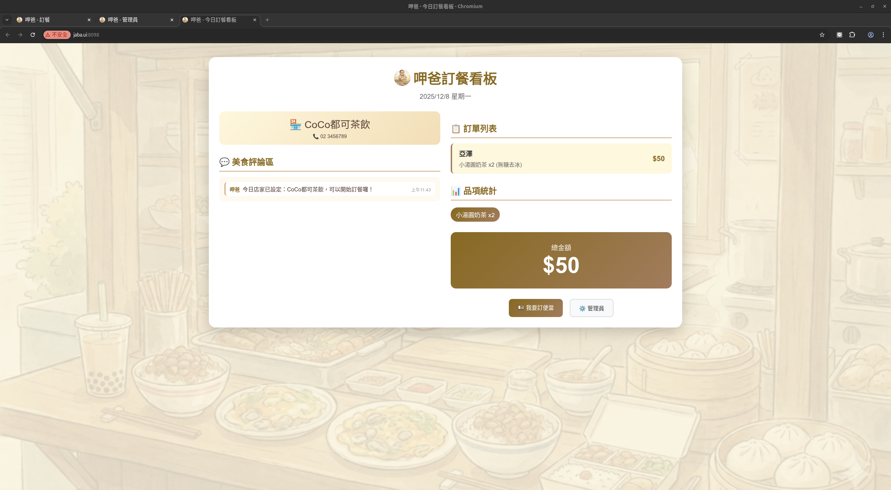
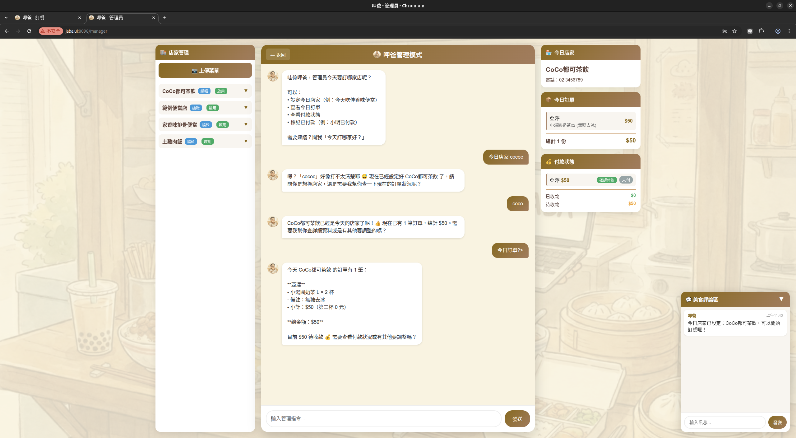
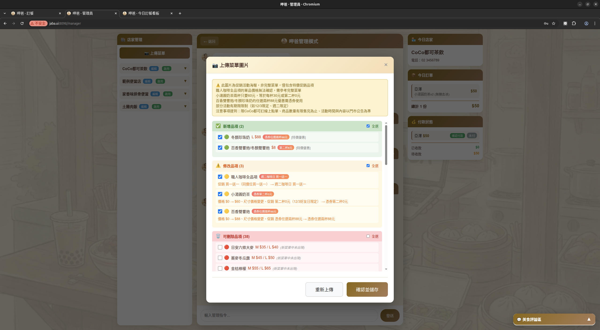

# jaba (呷爸)

AI 午餐訂便當系統 - 透過 LINE 群組輕鬆訂餐

呷爸是一個專為團隊設計的午餐訂餐系統，透過 LINE Bot 讓群組點餐變得簡單直覺。使用者只需在 LINE 群組中用自然語言告訴呷爸想吃什麼，系統就會自動處理訂單。

> **版本演進**：早期版本採用 WebUI 點餐介面（參考 [demo/01-order-page-chat.png](demo/01-order-page-chat.png)），現已全面改為透過 LINE Bot 運作——使用者可在 1對1 聊天中設定個人偏好，並在群組中進行點餐。

## 功能特色

### LINE 群組點餐
- **群組點餐 Session** - 群組專屬點餐流程，說「開單」開始、「收單」結束
- **AI 對話訂餐** - 用自然語言與 AI 互動，說「我要雞腿便當」就能完成訂餐
- **共享對話歷史** - AI 可理解跟單（+1）等上下文
- **多店家選擇** - 當天有多家店時，可自由選擇想訂的店家
- **訂單修改** - 可新增、移除品項或取消訂單
- **飲料縮寫辨識** - 支援「微微」「少少」「半半」等常見點法
- **自動過濾** - AI 自動辨識訂餐訊息，忽略閒聊
- **特價優惠** - 自動套用促銷折扣（買一送一、第二杯折扣、限時特價）
- **卡路里估算** - AI 自動估算餐點熱量
- **個人偏好** - 透過 1對1 聊天記住你的稱呼和飲食偏好（如「我不吃辣」），群組點餐時自動套用

### 超級管理員功能
- **群組管理** - 管理多個 LINE 群組的訂單
- **群組選擇器** - 切換不同群組查看訂單
- **訂單 CRUD** - 編輯、刪除使用者訂單
- **代理點餐** - 代替群組成員新增訂單
- **付款追蹤** - 標記付款狀態、處理退款
- **店家管理** - 新增、編輯、啟用/停用店家
- **菜單辨識** - 上傳菜單圖片，AI 自動辨識並建立菜單
- **差異預覽** - 辨識後顯示新增/修改/可刪除項目，選擇性套用變更
- **特價辨識** - 自動識別促銷標示（買一送一、第二杯折扣、限時特價）
- **菜單編輯** - 手動調整品項名稱、價格、尺寸變體
- **今日設定** - 設定單一或多家今日營業店家
- **歷史清理** - 清除過期訂單資料

### 系統功能
- **即時同步** - Socket.IO 即時廣播訂單與狀態變更
- **看板頁面** - 顯示所有群組訂單、美食評論區、LINE QRCode
- **美食評論區** - 顯示 LINE 群組中的點餐對話
- **Session 管理** - 每日對話紀錄自動管理
- **LINE Bot 狀態監控** - 即時顯示 LINE Bot 運行狀態，每分鐘自動檢查（解決 Render 冷啟動問題）

## 系統畫面

| 頁面 | 說明 |
|------|------|
| `/` | 今日訂餐看板 - 顯示群組訂單、美食評論區、LINE QRCode |
| `/manager` | 超級管理員頁面 - 群組訂單管理、店家管理、付款追蹤 |

### 今日看板



顯示所有群組的訂單、美食評論區（LINE 群組對話）、LINE QRCode 方便加入呷爸好友，以及 LINE Bot 運行狀態。

### 超級管理員頁面



管理員可選擇群組、查看訂單、代理點餐、標記付款狀態。左側面板顯示 LINE Bot 狀態與店家管理。

### 菜單辨識與差異預覽



上傳菜單圖片後，AI 自動辨識並顯示差異預覽：綠色為新增、黃色為修改、紅色為可刪除。

## 技術架構


| 組件 | 技術 |
|------|------|
| 後端框架 | FastAPI + Socket.IO (ASGI) |
| AI 整合 | Claude CLI / Gemini CLI (Provider 模組化架構) |
| 前端 | 純 HTML/CSS/JavaScript |
| 資料存儲 | JSON 檔案 |
| 套件管理 | uv |

## 快速開始

### 環境需求

- Python 3.12+
- [uv](https://docs.astral.sh/uv/) 套件管理器
- [Claude CLI](https://docs.anthropic.com/en/docs/claude-cli) 或 Gemini CLI

### 本機執行

```bash
# 安裝依賴
uv sync

# 設定 API 金鑰（Claude CLI 需要）
export ANTHROPIC_API_KEY="your-api-key"

# 啟動伺服器（預設 port 8098）
uv run uvicorn main:socket_app --reload --host 0.0.0.0 --port 8098
```

## 使用指南

### LINE 群組點餐

1. 將呷爸 LINE Bot 加入群組
2. 發送「啟用」讓呷爸加入白名單
3. 點餐流程：
   - 發送「開單」開始群組點餐
   - 與呷爸對話，例如：
     - 「我要雞腿便當」
     - 「+1」（跟單上一個人的餐點）
     - 「不要了」（取消自己的訂單）
     - 「珍奶 微微 L」（飲料縮寫）
   - 發送「收單」結束點餐並顯示統計

### 超級管理員

1. 開啟管理頁 `/manager`
2. 輸入管理員密碼登入（預設：`9898`）
3. 可執行的操作：
   - 選擇群組查看訂單
   - 編輯、刪除使用者訂單
   - 代理點餐
   - 標記付款狀態
   - 透過 AI 對話設定店家：
     - 「今天吃佳香味」- 設定今日店家
     - 「新增店家 xxx」- 建立新店家
4. 上傳菜單圖片讓 AI 自動建立菜單

## 專案結構

```
jaba/
├── main.py                 # FastAPI 應用程式入口
├── app/
│   ├── ai.py               # AI 整合主入口
│   ├── data.py             # 資料存取模組
│   └── providers/          # CLI Provider 模組
│       ├── __init__.py     # BaseProvider 抽象類別與工廠
│       ├── claude.py       # Claude CLI 實作
│       └── gemini.py       # Gemini CLI 實作
├── data/
│   ├── stores/             # 店家資料與菜單
│   │   └── {store_id}/
│   │       ├── info.json   # 店家資訊
│   │       ├── menu.json   # 菜單
│   │       └── images/     # 菜品圖片
│   ├── linebot/            # LINE Bot 群組資料
│   │   └── sessions/
│   │       └── {group_id}.json  # 群組點餐 session（含訂單、付款）
│   ├── users/              # 使用者資料（以 LINE User ID 為識別）
│   │   └── {line_user_id}/
│   │       ├── profile.json    # 使用者偏好
│   │       └── chat_history/   # 對話歷史
│   ├── board_chat/         # 看板聊天記錄（聚合群組對話）
│   └── system/             # 系統設定
│       ├── config.json     # 系統配置
│       ├── today.json      # 今日店家
│       ├── ai_config.json  # AI 模型設定
│       ├── linebot_whitelist.json  # LINE Bot 白名單
│       └── prompts/        # AI 提示詞
├── templates/              # HTML 頁面
│   ├── index.html          # 今日看板頁
│   └── manager.html        # 超級管理員頁
├── demo/                   # Demo 截圖
├── static/                 # 靜態資源
│   ├── css/style.css
│   └── images/
└── pyproject.toml
```

## 設定說明

### 系統設定 (`data/system/config.json`)

```json
{
  "admin_password": "9898",
  "server_port": 8098
}
```

### AI 模型設定 (`data/system/ai_config.json`)

```json
{
  "chat": {
    "provider": "claude",
    "model": "haiku"
  },
  "menu_recognition": {
    "provider": "claude",
    "model": "sonnet"
  }
}
```

支援的模型：
- Claude: `haiku`, `sonnet`, `opus`
- Gemini: 需安裝 Gemini CLI

## API 端點

### 公開 API

| 方法 | 路徑 | 說明 |
|------|------|------|
| GET | `/api/today` | 取得今日店家資訊 |
| GET | `/api/stores` | 取得啟用的店家列表 |
| GET | `/api/menu/{store_id}` | 取得店家菜單 |
| POST | `/api/chat` | 與 AI 對話（群組點餐/管理員模式） |
| GET | `/api/board/chat` | 取得看板用的聚合群組對話 |
| GET | `/api/board/orders` | 取得看板用的所有群組訂單 |

### 超級管理員 API

| 方法 | 路徑 | 說明 |
|------|------|------|
| POST | `/api/verify-admin` | 驗證管理員密碼 |
| GET | `/api/super-admin/groups` | 取得所有已啟用群組 |
| GET | `/api/super-admin/groups/{group_id}/orders` | 取得群組訂單 |
| POST | `/api/super-admin/groups/{group_id}/orders` | 代理點餐 |
| PUT | `/api/super-admin/groups/{group_id}/orders/{user_id}` | 修改訂單 |
| DELETE | `/api/super-admin/groups/{group_id}/orders/{user_id}` | 刪除訂單 |
| POST | `/api/super-admin/groups/{group_id}/payments/{user_id}/mark-paid` | 標記已付款 |
| POST | `/api/super-admin/groups/{group_id}/payments/{user_id}/refund` | 標記已退款 |
| GET | `/api/stores/all` | 取得所有店家與菜單 |
| POST | `/api/recognize-menu` | AI 辨識菜單圖片（含差異比對） |
| POST | `/api/save-menu` | 儲存菜單（支援差異模式） |

### LINE Bot API

| 方法 | 路徑 | 說明 |
|------|------|------|
| POST | `/api/linebot/register` | 註冊白名單（啟用點餐功能） |
| DELETE | `/api/linebot/unregister` | 取消註冊（清除相關資料） |
| GET | `/api/linebot/check` | 檢查是否已啟用 |
| GET | `/api/linebot/session/{group_id}` | 檢查群組是否在點餐中 |

### Socket.IO 事件

| 事件 | 說明 |
|------|------|
| `group_session_started` | 群組點餐開始 |
| `group_order_updated` | 群組訂單更新 |
| `group_session_ended` | 群組點餐結束 |
| `group_chat_updated` | 群組對話更新 |
| `board_chat_message` | 看板聊天訊息 |
| `store_changed` | 今日店家變更 |
| `payment_updated` | 付款狀態更新 |

## 開發指南

### 本機開發

```bash
# 啟動開發伺服器（自動重載）
uv run uvicorn main:socket_app --reload --host 0.0.0.0 --port 8098
```

### 自訂 AI 提示詞

編輯 `data/system/prompts/` 目錄下的檔案：
- `manager_prompt.md` - 管理員對話提示詞
- `group_ordering_prompt.md` - LINE 群組點餐提示詞
- `personal_prompt.md` - 個人偏好設定提示詞（1對1 聊天）
- `menu_recognition_prompt.md` - 菜單辨識提示詞

## AI Prompt Context 架構

呷爸的 AI 對話由四個部分組成，每次對話時動態組合：


<details>
<summary>文字版架構圖</summary>

```
┌─────────────────────────────────────────────────────────┐
│                    完整 AI 訊息                          │
├─────────────────────────────────────────────────────────┤
│  Layer 4 (Top): 當前訊息 (Current Message)              │
│     └─ 使用者輸入的文字                                 │
├─────────────────────────────────────────────────────────┤
│  Layer 3: 對話歷史 (Chat History)                       │
│     └─ 最近 20 條對話記錄                               │
├─────────────────────────────────────────────────────────┤
│  Layer 2: 動態上下文 (Dynamic Context)                  │
│     └─ JSON: 今日店家、菜單、使用者偏好、目前訂單       │
├─────────────────────────────────────────────────────────┤
│  Layer 1 (Base): 系統提示詞 (System Prompt)             │
│     └─ group_ordering_prompt.md 或 manager_prompt.md    │
└─────────────────────────────────────────────────────────┘
                         │
                         ▼
              ┌─────────────────────┐
              │    AI Response      │
              │  {message, actions[]}│
              └─────────────────────┘
```

</details>

### 1. 系統提示詞

定義呷爸的個性、語氣、可執行動作與回應格式。

| 模式 | 檔案 | 內容 |
|------|------|------|
| 群組點餐模式 | `group_ordering_prompt.md` | LINE 群組訂餐助手角色、訂單操作動作 |
| 個人偏好模式 | `personal_prompt.md` | 1對1 聊天偏好設定、不可點餐 |
| 管理員模式 | `manager_prompt.md` | 管理助手角色、店家/訂單管理動作 |

### 2. 動態上下文

`build_context()` 函式根據模式產生不同的上下文資料：

**共用欄位：**
```json
{
  "today": "2025-12-08",
  "today_stores": [{"store_id": "coco", "store_name": "CoCo都可茶飲"}],
  "menus": { "coco": { "name": "CoCo都可茶飲", "menu": {...} } }
}
```

**群組點餐模式額外欄位：**
```json
{
  "group_id": "C1234567890",
  "group_name": "午餐群",
  "session_active": true,
  "group_orders": [{ "user_id": "U123", "display_name": "小明", "items": [...], "total": 50 }],
  "chat_history": [{ "role": "user", "name": "小明", "content": "我要雞腿便當" }]
}
```

**管理員模式額外欄位：**
```json
{
  "available_stores": [{"id": "coco", "name": "CoCo都可茶飲"}]
}
```

> 注意：訂單和付款管理透過超級管理員頁面操作，不透過管理員對話模式。

### 3. 對話歷史

系統自動維護對話歷史，格式依模式不同：

**群組點餐模式** - 群組 session 內的對話記錄：
```
小明: 我要點珍珠奶茶
呷爸: 好的，已經幫小明點了珍珠奶茶 M 杯 $50！
小華: +1
呷爸: 好的，已經幫小華跟單珍珠奶茶 M 杯 $50！
```

**管理員模式** - 管理員 session 內的對話記錄（最多 20 條）

### 4. 完整訊息組合

最終送給 AI 的訊息格式（`app/ai.py`）：

```
[系統上下文]
{context JSON}

[對話歷史]
{formatted history}

[當前訊息]
{user message}

請以 JSON 格式回應：
{"message": "...", "actions": [...]}
```

### 相關程式碼

| 函式 | 檔案 | 說明 |
|------|------|------|
| `get_system_prompt()` | `app/ai.py` | 載入系統提示詞 |
| `build_context()` | `app/ai.py` | 建立動態上下文 |
| `get_ai_chat_history()` | `app/data.py` | 取得對話歷史 |
| `call_ai()` | `app/ai.py` | 組合並呼叫 AI |

## 授權

MIT License
