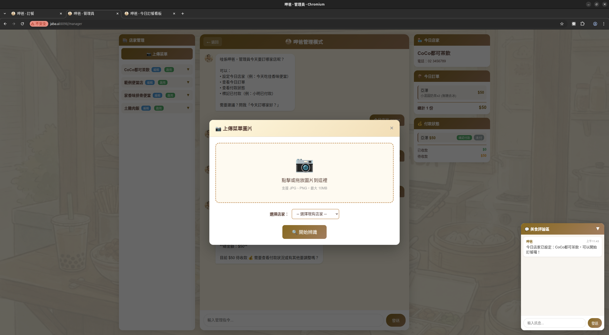
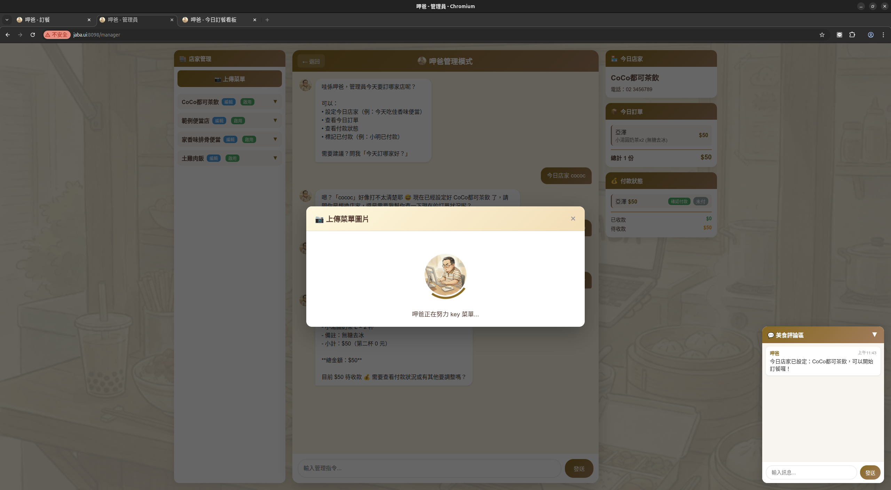
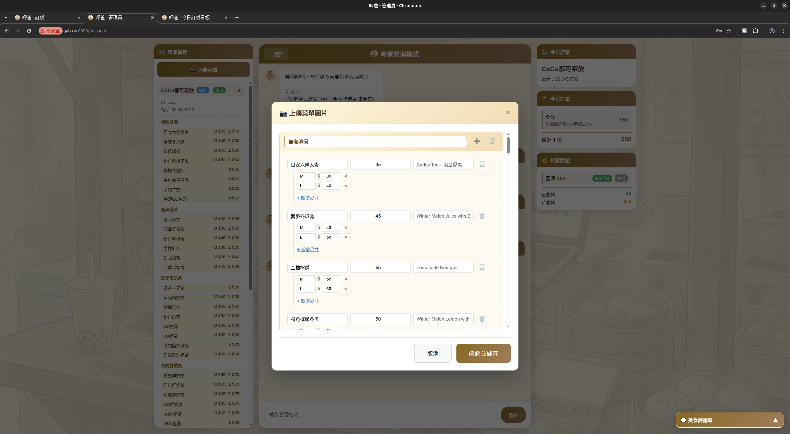
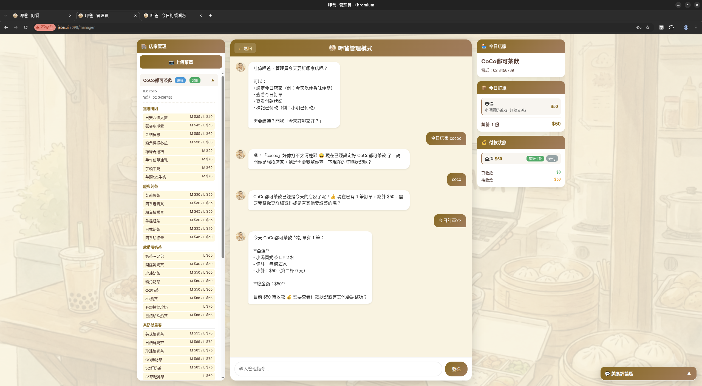

# 呷爸 Demo 流程說明

本文檔說明呷爸 (jaba) AI 午餐訂便當系統的主要使用流程。

---

## 1. 今日訂餐看板

首頁顯示今日訂餐總覽，包含店家資訊、訂單列表與品項統計。


**功能說明：**
- 顯示今日營業店家
- 美食評論區：呷爸的每日推薦
- 訂單列表：即時顯示所有人的訂單
- 品項統計：彙整各品項訂購數量
- 總金額統計

---

## 2. 訂餐頁面 - AI 對話訂餐

使用者可透過自然語言與呷爸對話完成訂餐。


**介面組成：**
- **左側**：今日店家菜單，可直接點擊快速訂餐
- **中間**：與呷爸的對話區，支援自然語言訂餐
- **右側**：
  - 上方：個人訂單摘要
  - 下方：團體聊天室

**對話範例：**
- 「我要點珍珠奶茶」
- 「幫我加一杯紅茶拿鐵，大杯」
- 「取消訂單」
- 「今天吃什麼好？」

**特價品項：**
- 菜單中的特價品項會顯示促銷標籤
- 訂購時自動套用優惠（買一送一、第二杯折扣等）

---

## 3. 管理頁面 - 呷爸管理模式

管理員可透過對話管理店家、訂單與付款。


**介面組成：**
- **左側**：店家列表，可展開查看菜單
- **中間**：與呷爸管理員助手對話
- **右側**：
  - 上方：當前店家菜單與訂單統計
  - 下方：團體聊天室

**管理指令範例：**
- 「今天吃 CoCo」- 設定今日店家
- 「新增店家 xxx」- 建立新店家
- 「小明已付款」- 標記付款狀態
- 「清除所有訂單」- 重置今日訂單

---

## 4. 菜單辨識流程

### 4.1 上傳菜單圖片

點擊「上傳菜單圖片」按鈕，選擇店家並上傳圖片。



- 可選擇現有店家或輸入新店家名稱
- 支援 JPG、PNG 格式，最大 10MB

### 4.2 AI 辨識中

上傳後，呷爸會自動分析菜單圖片。



- AI 會識別品項名稱、價格、規格
- 自動偵測特價促銷標示

### 4.3 差異預覽

辨識完成後顯示差異預覽，可選擇性套用變更。


**差異標示：**
- **綠色（新增品項）**：辨識到的新品項，預設勾選
- **黃色（修改品項）**：價格或名稱有變更，預設勾選
- **紅色（可刪除品項）**：現有菜單中有但新圖片沒拍到的品項，預設不勾選

**操作說明：**
- 勾選要套用的變更
- 點擊「確認並儲存」套用勾選的項目
- 或點擊「取消上傳」放棄變更
- 可切換到「完整編輯模式」進行細部調整

### 4.4 完整編輯模式

需要細部調整時，可切換到完整編輯模式。



- 可編輯品項名稱、價格、規格
- 可調整尺寸變體（M/L 等）
- 儲存後會覆蓋整個菜單

---

## 5. 管理頁含菜單展開

展開店家可查看完整菜單內容。



- 點擊店家名稱展開/收合菜單
- 可直接查看各分類品項
- 支援啟用/停用店家

---

## 系統流程總覽

```
管理員設定今日店家
       ↓
使用者開啟訂餐頁
       ↓
透過對話或點擊菜單訂餐
       ↓
訂單即時同步到看板
       ↓
管理員標記付款狀態
       ↓
完成訂餐流程
```
